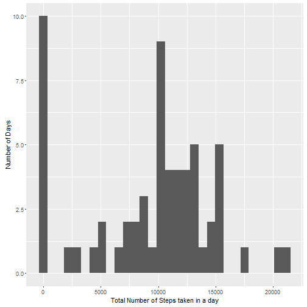

## R Markdown

**Loading and preprocessing the data**

This chunk is for  
1. Load the data (i.e. read.csv())  
2. Process/transform the data (if necessary) into a format suitable for analysis  


```r
## Download the data and unzip to the current working directory 
fileUrl <- "https://d396qusza40orc.cloudfront.net/repdata%2Fdata%2Factivity.zip"
destFile <- "activityData.zip"
download.file(url = fileUrl,destfile = destFile, mode = "wb")
unzip(destFile,exdir=".")

## Read the unzipped data into R
colClass = c("integer","character","integer")
actvty <- read.csv("activity.csv",colClasses = colClass)

## Process the data - convert the class of date column from 'character' to Date 
actvty$date = as.Date(actvty$date,"%Y-%m-%d")
```

**What is mean total number of steps taken per day?**

For this part of the assignment, the missing values in the dataset are ignored.  
1. Calculate the total number of steps taken per day  
2. Make a histogram of the total number of steps taken each day  
3. Calculate and report the mean and median of the total number of steps taken per day  


```r
## summarize the 'steps' by 'date' - calculate total, mean and median
library(dplyr)
actvty_summary <- tbl_df(actvty) %>%
                mutate(totalsteps = NA, meansteps = NA, mediansteps = NA) %>%
                group_by(date) %>%
                summarize(totalsteps = sum(steps, na.rm=TRUE),
                          meansteps = mean(steps, na.rm=TRUE),
                          mediansteps = median(steps, na.rm=TRUE))

## Make histogram
library(ggplot2)
g <- ggplot(actvty_summary, aes(totalsteps)) 
g + geom_histogram(bins = 30) + labs(x = "Total Number of Steps taken in a day",
                            y = "Number of Days")
```



```r
## report the Mean and Median steps per day
as.data.frame(subset(actvty_summary,select=c("date","meansteps","mediansteps")))
```

```
##          date  meansteps mediansteps
## 1  2012-10-01        NaN          NA
## 2  2012-10-02  0.4375000           0
## 3  2012-10-03 39.4166667           0
## 4  2012-10-04 42.0694444           0
## 5  2012-10-05 46.1597222           0
## 6  2012-10-06 53.5416667           0
## 7  2012-10-07 38.2465278           0
## 8  2012-10-08        NaN          NA
## 9  2012-10-09 44.4826389           0
## 10 2012-10-10 34.3750000           0
## 11 2012-10-11 35.7777778           0
## 12 2012-10-12 60.3541667           0
## 13 2012-10-13 43.1458333           0
## 14 2012-10-14 52.4236111           0
## 15 2012-10-15 35.2048611           0
## 16 2012-10-16 52.3750000           0
## 17 2012-10-17 46.7083333           0
## 18 2012-10-18 34.9166667           0
## 19 2012-10-19 41.0729167           0
## 20 2012-10-20 36.0937500           0
## 21 2012-10-21 30.6284722           0
## 22 2012-10-22 46.7361111           0
## 23 2012-10-23 30.9652778           0
## 24 2012-10-24 29.0104167           0
## 25 2012-10-25  8.6527778           0
## 26 2012-10-26 23.5347222           0
## 27 2012-10-27 35.1354167           0
## 28 2012-10-28 39.7847222           0
## 29 2012-10-29 17.4236111           0
## 30 2012-10-30 34.0937500           0
## 31 2012-10-31 53.5208333           0
## 32 2012-11-01        NaN          NA
## 33 2012-11-02 36.8055556           0
## 34 2012-11-03 36.7048611           0
## 35 2012-11-04        NaN          NA
## 36 2012-11-05 36.2465278           0
## 37 2012-11-06 28.9375000           0
## 38 2012-11-07 44.7326389           0
## 39 2012-11-08 11.1770833           0
## 40 2012-11-09        NaN          NA
## 41 2012-11-10        NaN          NA
## 42 2012-11-11 43.7777778           0
## 43 2012-11-12 37.3784722           0
## 44 2012-11-13 25.4722222           0
## 45 2012-11-14        NaN          NA
## 46 2012-11-15  0.1423611           0
## 47 2012-11-16 18.8923611           0
## 48 2012-11-17 49.7881944           0
## 49 2012-11-18 52.4652778           0
## 50 2012-11-19 30.6979167           0
## 51 2012-11-20 15.5277778           0
## 52 2012-11-21 44.3993056           0
## 53 2012-11-22 70.9270833           0
## 54 2012-11-23 73.5902778           0
## 55 2012-11-24 50.2708333           0
## 56 2012-11-25 41.0902778           0
## 57 2012-11-26 38.7569444           0
## 58 2012-11-27 47.3819444           0
## 59 2012-11-28 35.3576389           0
## 60 2012-11-29 24.4687500           0
## 61 2012-11-30        NaN          NA
```

**What is the average daily activity pattern?**

1.Make a time series plot (i.e. type = "l") of the 5-minute interval (x-axis) and the average number of steps taken, averaged across all days (y-axis)  
2.Which 5-minute interval, on average across all the days in the dataset, contains the maximum number of steps?   


```r
## Summarize across all days for the 5-minute interval
actvty1_tdf <- tbl_df(actvty) %>%
        mutate(totalsteps = NA, meansteps = NA, mediansteps = NA) %>%
        group_by(interval) %>%
        summarize(totalsteps = sum(steps, na.rm=TRUE),
                  meansteps = mean(steps, na.rm=TRUE),
                  mediansteps = median(steps, na.rm=TRUE))

## make the plot
g2 <- ggplot(actvty1_tdf,aes(interval,meansteps))
g2 + geom_line(na.rm = TRUE) + 
        labs(y= "Mean No. of steps taken across all days", x = "Time Interval")
```


```r
## Find & report which interval has the max(Avg Steps)
maxMeanSteps <- max(actvty1_tdf$meansteps,na.rm = TRUE)
maxInterval <- actvty1_tdf[which(actvty1_tdf$meansteps == maxMeanSteps),1]
maxInterval$interval
```

```
## [1] 835
```

**Imputing missing values**  

There are a number of days/intervals where there are missing values (coded as **NA**). The presence of missing days may introduce bias into some calculations or summaries of the data.  

1.Calculate and report the total number of missing values in the dataset (i.e. the total number of rows with NAs)  
2.Devise a strategy for filling in all of the missing values in the dataset. The strategy does not need to be sophisticated. For example, you could use the mean/median for that day, or the mean for that 5-minute interval, etc.  
3.Create a new dataset that is equal to the original dataset but with the missing data filled in.  
4.Make a histogram of the total number of steps taken each day and Calculate and report the mean and median total number of steps taken per day. Do these values differ from the estimates from the first part of the assignment? What is the impact of imputing missing data on the estimates of the total daily number of steps?  


```r
## count No of rows missing values
sum(is.na(actvty$steps))
```

```
## [1] 2304
```

```r
## strategy for imputing data via K nearest neighbour 
library(impute)
actvty.subset <- as.matrix(subset(actvty,select = c("steps","interval")))
steps.imputed <- impute.knn(actvty.subset)$data[,"steps"]
```

```
## Cluster size 17568 broken into 8784 8784 
## Cluster size 8784 broken into 4445 4339 
## Cluster size 4445 broken into 2250 2195 
## Cluster size 2250 broken into 1111 1139 
## Done cluster 1111 
## Done cluster 1139 
## Done cluster 2250 
## Cluster size 2195 broken into 862 1333 
## Done cluster 862 
## Done cluster 1333 
## Done cluster 2195 
## Done cluster 4445 
## Cluster size 4339 broken into 2195 2144 
## Cluster size 2195 broken into 980 1215 
## Done cluster 980 
## Done cluster 1215 
## Done cluster 2195 
## Cluster size 2144 broken into 2044 100 
## Cluster size 2044 broken into 1174 870 
## Done cluster 1174 
## Done cluster 870 
## Done cluster 2044 
## Done cluster 100 
## Done cluster 2144 
## Done cluster 4339 
## Done cluster 8784 
## Cluster size 8784 broken into 4401 4383 
## Cluster size 4401 broken into 2275 2126 
## Cluster size 2275 broken into 2007 268 
## Cluster size 2007 broken into 845 1162 
## Done cluster 845 
## Done cluster 1162 
## Done cluster 2007 
## Done cluster 268 
## Done cluster 2275 
## Cluster size 2126 broken into 928 1198 
## Done cluster 928 
## Done cluster 1198 
## Done cluster 2126 
## Done cluster 4401 
## Cluster size 4383 broken into 2187 2196 
## Cluster size 2187 broken into 976 1211 
## Done cluster 976 
## Done cluster 1211 
## Done cluster 2187 
## Cluster size 2196 broken into 1220 976 
## Done cluster 1220 
## Done cluster 976 
## Done cluster 2196 
## Done cluster 4383 
## Done cluster 8784
```

```r
## Clone the original data and then impute the missing values
actvty2 <- actvty
actvty2$steps[is.na(actvty$steps)] <- 
        as.integer(steps.imputed[is.na(actvty$steps)])

## Make historgram with the imputed data
actvty2_imp <- tbl_df(actvty2) %>%
                mutate(totalsteps = NA, meansteps = NA, mediansteps = NA) %>%
                group_by(date) %>%
                summarize(totalsteps = sum(steps, na.rm=TRUE),
                        meansteps = mean(steps, na.rm=TRUE),
                        mediansteps = median(steps, na.rm=TRUE))

g3 <- ggplot(actvty2_imp, aes(totalsteps)) 
g3 + geom_histogram(bins = 30) + 
        labs(x = "Total Number of Imputed Steps taken in a day",
             y = "Number of Days")
```


```r
## report the Mean and Median steps per day
as.data.frame(subset(actvty2_imp,select=c("date","meansteps","mediansteps")))
```

```
##          date  meansteps mediansteps
## 1  2012-10-01 20.2013889         8.5
## 2  2012-10-02  0.4375000         0.0
## 3  2012-10-03 39.4166667         0.0
## 4  2012-10-04 42.0694444         0.0
## 5  2012-10-05 46.1597222         0.0
## 6  2012-10-06 53.5416667         0.0
## 7  2012-10-07 38.2465278         0.0
## 8  2012-10-08 20.2013889         8.5
## 9  2012-10-09 44.4826389         0.0
## 10 2012-10-10 34.3750000         0.0
## 11 2012-10-11 35.7777778         0.0
## 12 2012-10-12 60.3541667         0.0
## 13 2012-10-13 43.1458333         0.0
## 14 2012-10-14 52.4236111         0.0
## 15 2012-10-15 35.2048611         0.0
## 16 2012-10-16 52.3750000         0.0
## 17 2012-10-17 46.7083333         0.0
## 18 2012-10-18 34.9166667         0.0
## 19 2012-10-19 41.0729167         0.0
## 20 2012-10-20 36.0937500         0.0
## 21 2012-10-21 30.6284722         0.0
## 22 2012-10-22 46.7361111         0.0
## 23 2012-10-23 30.9652778         0.0
## 24 2012-10-24 29.0104167         0.0
## 25 2012-10-25  8.6527778         0.0
## 26 2012-10-26 23.5347222         0.0
## 27 2012-10-27 35.1354167         0.0
## 28 2012-10-28 39.7847222         0.0
## 29 2012-10-29 17.4236111         0.0
## 30 2012-10-30 34.0937500         0.0
## 31 2012-10-31 53.5208333         0.0
## 32 2012-11-01 20.2013889         8.5
## 33 2012-11-02 36.8055556         0.0
## 34 2012-11-03 36.7048611         0.0
## 35 2012-11-04 20.2013889         8.5
## 36 2012-11-05 36.2465278         0.0
## 37 2012-11-06 28.9375000         0.0
## 38 2012-11-07 44.7326389         0.0
## 39 2012-11-08 11.1770833         0.0
## 40 2012-11-09 20.2013889         8.5
## 41 2012-11-10 20.2013889         8.5
## 42 2012-11-11 43.7777778         0.0
## 43 2012-11-12 37.3784722         0.0
## 44 2012-11-13 25.4722222         0.0
## 45 2012-11-14 20.2013889         8.5
## 46 2012-11-15  0.1423611         0.0
## 47 2012-11-16 18.8923611         0.0
## 48 2012-11-17 49.7881944         0.0
## 49 2012-11-18 52.4652778         0.0
## 50 2012-11-19 30.6979167         0.0
## 51 2012-11-20 15.5277778         0.0
## 52 2012-11-21 44.3993056         0.0
## 53 2012-11-22 70.9270833         0.0
## 54 2012-11-23 73.5902778         0.0
## 55 2012-11-24 50.2708333         0.0
## 56 2012-11-25 41.0902778         0.0
## 57 2012-11-26 38.7569444         0.0
## 58 2012-11-27 47.3819444         0.0
## 59 2012-11-28 35.3576389         0.0
## 60 2012-11-29 24.4687500         0.0
## 61 2012-11-30 20.2013889         8.5
```
  
**Are there differences in activity patterns between weekdays and weekends?**  
  
  Use the dataset with the filled-in missing values for this part.  
  
1.Create a new factor variable in the dataset with 2 levels - weekday and weekend indicating the given date is week day or week end  
2.Make a panel plot containing a time series plot of the 5-minute interval (x-axis) and the average number of steps taken, averaged across all weekday days or weekend days (y-axis). See the README file in the GitHub repository to see an example of what this plot should look like using simulated data   


```r
## create a factor variable dayCategory
weekends <- c("Saturday", "Sunday")
actvty2$weekEndFlag <- weekdays(actvty2$date) %in% weekends
actvty2$dayCategory <- "weekday"
actvty2$dayCategory[actvty2$weekEndFlag] <- "weekend"

## Make time series panel plot
actvty3_tdf <- tbl_df(actvty2) %>%
        mutate(totalsteps = NA, meansteps = NA, mediansteps = NA) %>%
        group_by(dayCategory,interval) %>%
        summarize(totalsteps = sum(steps, na.rm=TRUE),
                  meansteps = mean(steps, na.rm=TRUE),
                  mediansteps = median(steps, na.rm=TRUE))

g3 <- ggplot(actvty3_tdf, aes(interval,meansteps)) 
g3 + geom_line() +
        facet_grid(dayCategory ~ .) +
        labs(y = "Mean Number of Imputed Steps", x= "5-minute time interval")
```


